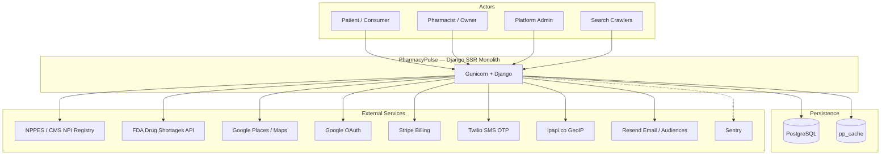
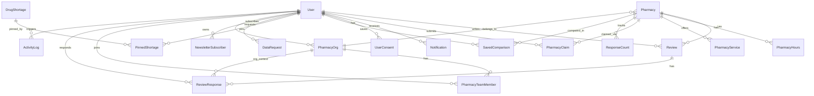
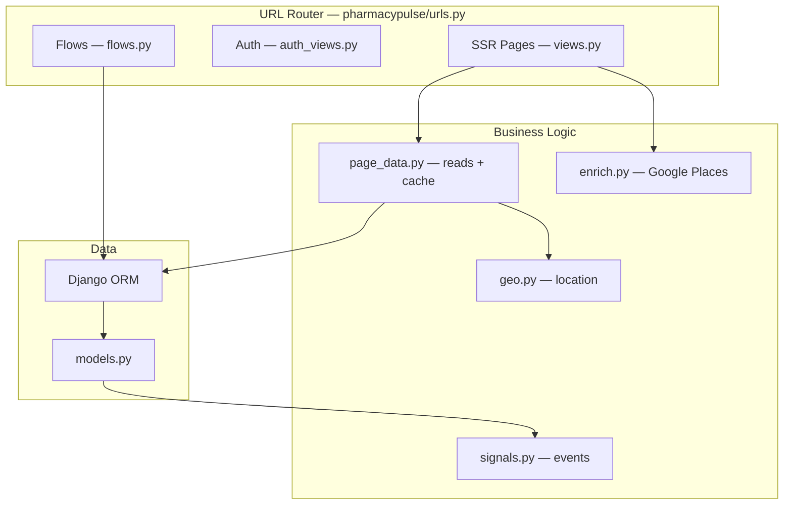
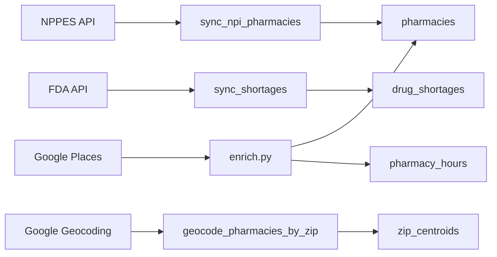
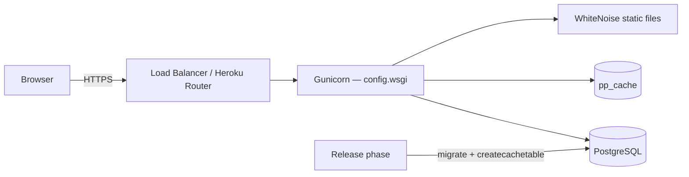
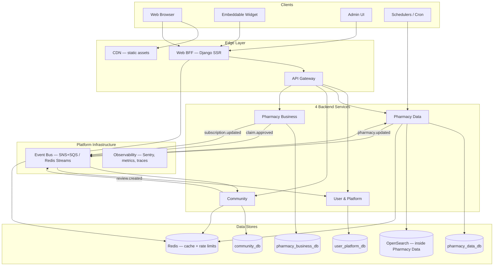
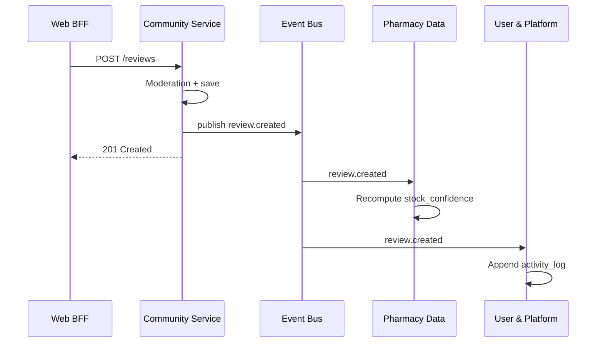

# PharmacyPulse — Architecture Document

**Project:** PharmacyPulse (ByondRx / BEN-156)  
**Version:** 1.1  
**Last updated:** June 2026  
**Status:** Current-state reference + proposed microservices target architecture (4 services + BFF)

---

## Table of contents

1. [Executive summary](#1-executive-summary)
2. [Current architecture (monolith)](#2-current-architecture-monolith)
3. [Database schema](#3-database-schema)
4. [Application layers](#4-application-layers)
5. [External integrations](#5-external-integrations)
6. [Deployment](#6-deployment)
7. [Proposed microservices architecture](#7-proposed-microservices-architecture)
8. [Service catalog](#8-service-catalog)
9. [Data ownership & events](#9-data-ownership--events)
10. [Migration roadmap](#10-migration-roadmap)
11. [Trade-offs & recommendations](#11-trade-offs--recommendations)
12. [Appendix: route & table index](#12-appendix-route--table-index)

---

## 1. Executive summary

PharmacyPulse is a **community-powered pharmacy review platform** built as a **Django 4.2 monolith** with server-side rendering (SSR). It was ported from the Benmore prototype and preserves original URL paths, flow endpoints, and database table names.

| Aspect | Current state |
|--------|---------------|
| **Pattern** | Modular monolith (single deployable) |
| **Runtime** | Gunicorn + Django WSGI |
| **Database** | PostgreSQL (prod), SQLite (local dev) |
| **Cache** | PostgreSQL `pp_cache` table (prod), LocMem (dev) |
| **Frontend** | Django Templates + Tailwind CSS |
| **API style** | Form POST flows under `/api/flow/…` + SSR pages |

This document serves two purposes:

1. **Reference** — Describes how the system works today (for onboarding, audits, and proposals).
2. **Proposal** — Outlines a **microservices target architecture** with **4 backend services + a Web BFF**, event flows, and a phased migration plan using the **Strangler Fig** pattern.

> **Note:** A production PostgreSQL dump (`latest.dump`, ~7.1 MB) exists in the repo root. Restore with `pg_restore` into a local Postgres instance to inspect live data volumes and query patterns.

---

## 2. Current architecture (monolith)

### 2.1 System context



### 2.2 Request pipeline

Every HTTP request passes through middleware before reaching a view or flow handler:

| Order | Middleware | Purpose |
|-------|------------|---------|
| 1 | `SecurityMiddleware` | HTTPS redirects, security headers (prod) |
| 2 | `WhiteNoiseMiddleware` | Static asset serving |
| 3 | `GeoBlockMiddleware` | Non-US IPs → HTTP 451 (optional, prod) |
| 4 | `ContentSecurityPolicyMiddleware` | XSS mitigation; allows Maps, Stripe, Tailwind CDN |
| 5 | `SessionMiddleware` | 30-day rolling session (`pp_session` cookie) |
| 6 | `LocaleMiddleware` | i18n (en / es) |
| 7 | `CsrfViewMiddleware` | CSRF protection on POST |
| 8 | `AuthenticationMiddleware` | Session-based auth |
| 9 | `MessageMiddleware` | Flash messages |

**Config:** `config/settings.py`, `pharmacypulse/middleware.py`

### 2.3 Code structure

```
config/
├── settings.py          # Env, BRAND, ROLE_SCOPES, DATABASE, CACHE
├── urls.py              # Root URLconf (django-admin + app include)
└── wsgi.py              # Gunicorn entry point

pharmacypulse/
├── urls.py              # All routes → views | auth_views | flows
├── views.py             # Thin SSR wrappers (27+ pages)
├── page_data.py         # Read-heavy ORM queries + caching (~1600 lines)
├── flows.py             # Write operations + external APIs (~1400 lines)
├── auth_views.py        # Login, signup, Google OAuth, password reset
├── models.py            # 21 domain tables
├── signals.py           # Review stats, moderation, activity log, consents
├── middleware.py        # GeoBlock + CSP
├── geo.py               # Location resolution (ZIP, cookie, IP)
├── enrich.py            # Google Places lazy enrichment
├── resend_audience.py   # Resend newsletter sync
├── context_processors.py
├── forms.py
├── management/commands/ # NPPES sync, FDA sync, geocode, seed, dedupe
└── templates/pharmacypulse/
    ├── pages/           # Page templates
    ├── partials/        # topbar, footer, nav, cookie consent
    └── layouts/         # app.html, blank.html
```

### 2.4 Role model

| Role | Scopes (from `ROLE_SCOPES`) |
|------|----------------------------|
| **admin** | Full access (`*`) |
| **pharmacist** | Pharmacies, reviews, claims, hours, services, orgs, team, responses |
| **user** | Read pharmacies/shortages; write reviews and claims |

**Claim → pharmacist promotion:**

1. User submits claim at `/claim`
2. `POST /api/flow/verify-claim/<pharmacy_id>` verifies NPI against NPPES
3. Creates `PharmacyClaim`, `PharmacyOrg`, `PharmacyTeamMember`
4. Updates `pharmacies.claimed_by`, `org_id`; sets `user.role = pharmacist`

---

## 3. Database schema

21 domain tables in `pharmacypulse/models.py`, ported from Benmore `schema.sql`. Table names are preserved for compatibility.

### 3.1 Entity-relationship diagram



### 3.2 Table inventory

| Table | Model | Domain | Purpose |
|-------|-------|--------|---------|
| `_benmore_users` | `User` | Identity | Auth, roles, Stripe subscription state |
| `_benmore_notifications` | `Notification` | Comms | In-app notifications |
| `pharmacies` | `Pharmacy` | Catalog | Core entity — NPI, ratings, geo, claim state |
| `pharmacy_hours` | `PharmacyHours` | Catalog | Operating hours (Google-enriched) |
| `pharmacy_services` | `PharmacyService` | Catalog | Service badges (compounding, specialty) |
| `reviews` | `Review` | Reviews | Patient reviews + pharmacist responses |
| `drug_shortages` | `DrugShortage` | Shortages | FDA shortage catalog |
| `pinned_shortages` | `PinnedShortage` | Shortages | User-pinned shortages |
| `pharmacy_claims` | `PharmacyClaim` | Claims | Ownership verification workflow |
| `pharmacy_orgs` | `PharmacyOrg` | Claims | Org created on claim approval |
| `pharmacy_team_members` | `PharmacyTeamMember` | Claims | Team invites + roles |
| `review_responses` | `ReviewResponse` | Reviews | Responder tracking |
| `response_counts` | `ResponseCount` | Reviews | Monthly response quota (free tier) |
| `activity_log` | `ActivityLog` | Compliance | Audit trail |
| `moderation_keywords` | `ModerationKeyword` | Reviews | PHI + profanity filters |
| `user_consents` | `UserConsent` | Compliance | TCPA, ToS, DNS (CCPA) |
| `data_requests` | `DataRequest` | Compliance | CCPA export/delete tracking |
| `saved_comparisons` | `SavedComparison` | Discovery | Compare list per user |
| `newsletter_subscribers` | `NewsletterSubscriber` | Comms | Newsletter + Resend sync |
| `zip_centroids` | `ZipCentroid` | Catalog | ZIP → lat/lng cache |
| `pharmacy_facts` | `PharmacyFact` | Content | Homepage "Did you know" cards |

**Additional tables:** Django system tables (`auth_*`, `django_session`, `django_migrations`) and `pp_cache` (DatabaseCache in prod).

### 3.3 Derived fields on `pharmacies`

| Field | Computation |
|-------|-------------|
| `stock_confidence` | Time-decay weighted % from reviews (7d=1.0, 14d=0.5, 30d=0.25) via `signals.py` |
| `avg_service_rating` / `avg_wait_time` | Aggregated from non-deleted reviews |
| `chain_size` | SQL aggregate by DBA name after NPPES sync |
| `is_digital` | From NPPES taxonomy (`3336M0002X` = mail order) |

---

## 4. Application layers

### 4.1 Layer diagram



### 4.2 Page → data provider map

| Route | Template | Data provider | Auth |
|-------|----------|---------------|------|
| `/` | `index.html` | `page_index` | Public |
| `/list` | `list.html` | `page_list` | Public |
| `/map` | `map.html` | `page_map` | Public |
| `/pharmacy` | `pharmacy.html` | `page_pharmacy_detail` | Public (+ lazy enrich) |
| `/review` | `review.html` | `page_write_review` | Required |
| `/reviews` | `reviews.html` | `page_reviews` | Public |
| `/compare` | `compare.html` | `page_compare` | Public |
| `/claim` | `claim.html` | `page_claim` | Required |
| `/shortages` | `shortages.html` | `page_shortages` | Public |
| `/insights` | `insights.html` | `page_insights` | Public |
| `/pharmacist-dashboard` | `pharmacist-dashboard.html` | `page_pharmacist_dashboard` | Pharmacist |
| `/admin-*` | admin templates | `page_admin_*` | Admin |

Full route list: `pharmacypulse/urls.py`, `pharmacypulse/templates/pharmacypulse/manifest.json`

### 4.3 Flow endpoints (mutations)

25+ endpoints under `/api/flow/…` in `flows.py`:

| Domain | Endpoints |
|--------|-----------|
| **Discovery** | `search`, `compare/add\|remove\|clear` |
| **Reviews** | `submit-review`, `respond-review`, `moderate-review`, `flag-review` |
| **Claims** | `verify-claim`, `approve-claim`, `reject-claim` |
| **Data sync** | `ingest-pharmacies`, `fetch-pharmacy-details`, `sync-shortages`, `bulk-delete-*` |
| **Billing** | `create-checkout`, `billing-portal`, `stripe-webhook` |
| **Compliance** | `ccpa-export`, `ccpa-delete` |
| **Team** | `team/invite`, `team/accept`, `team/role`, `team/remove` |
| **User admin** | `suspend-user`, `unsuspend-user`, `change-user-role` |
| **Profile** | `update-profile`, `change-password` |
| **Newsletter** | `newsletter/subscribe`, `newsletter/unsubscribe` |

### 4.4 Django signals (event hooks)

Ported from Benmore `hooks.yaml` → `pharmacypulse/signals.py`:

| Event | Effect |
|-------|--------|
| Review **insert** (pre_save) | Rate limit 1/pharmacy/user/24h; PHI + profanity moderation |
| Review **insert** (post_save) | Recompute pharmacy stats; activity log |
| Review **update** (post_save) | Recompute stats; increment `response_counts` if response added |
| Review **delete** (post_delete) | Activity log entry |
| Claim **insert/update** (post_save) | Activity log entry |
| User **signup** (post_save) | Auto-create TCPA, ToS, DNS consents |

### 4.5 Data ingestion pipeline



| Stage | Source | Target | Notes |
|-------|--------|--------|-------|
| Bulk seed | NPPES (CMS) | `pharmacies` | Free; paginated by ZIP-2 prefix |
| Map pins | ZIP centroids | `zip_centroids` | ~$0.005/ZIP one-time |
| Lazy enrich | Google Places | `place_id`, hours, geo | ~$0.034/pharmacy; 6-month cooldown |
| Chain detection | SQL on DBA names | `chain_size` | Internal |
| Shortages | FDA API | `drug_shortages` | Scheduled sync |

---

## 5. External integrations

| Service | Env vars | Used in | Trigger |
|---------|----------|---------|---------|
| PostgreSQL | `DATABASE_URL` | All ORM | Always (prod) |
| Google Places | `GOOGLE_PLACES_KEY` | `flows`, `enrich`, map pages | Page view / admin ingest |
| Google OAuth | `GOOGLE_OAUTH_CLIENT_*` | `auth_views` | Login / signup |
| Stripe | `STRIPE_*` | `flows` checkout + webhook | Pharmacist upgrade |
| Twilio | `TWILIO_*` | Claim OTP | Optional |
| Resend SMTP | `EMAIL_*` | Password reset | On demand |
| Resend Audiences | `RESEND_API_KEY`, `RESEND_AUDIENCE_ID` | `resend_audience.py` | Newsletter subscribe |
| ipapi.co | — | `geo.py`, geo-block | Per new IP (cached 24h) |
| Sentry | `SENTRY_DSN` | Error tracking | Uncaught exceptions |

---

## 6. Deployment



| Component | Technology |
|-----------|------------|
| Container | `Dockerfile` (Python 3.11-slim) |
| Process manager | Gunicorn (`Procfile`) |
| Release | `migrate` + `createcachetable` |
| Static files | WhiteNoise `CompressedManifestStaticFilesStorage` |
| Cache | DatabaseCache when `DATABASE_URL` is set |

---

## 7. Proposed microservices architecture

### 7.1 Goals

| Goal | Rationale |
|------|-----------|
| **Independent scaling** | Pharmacy catalog reads (list, map, search) dominate traffic; reviews and billing spike separately |
| **Team autonomy** | Claims/billing, reviews/moderation, and data ingestion can ship on independent cadences |
| **Fault isolation** | FDA sync or Google enrichment failures should not take down auth or checkout |
| **Technology flexibility** | Search/geo workloads may benefit from specialized stores (Elasticsearch, PostGIS) |
| **Compliance boundaries** | CCPA export/delete and audit log live in User & Platform (same trust domain as auth) |

### 7.2 Service consolidation rationale

The original 9-service design split every domain into its own deployable. That is operationally heavy for a team this size. The target architecture **merges similar concerns** into **4 backend services**:

| Merged service | Combines (old) | Why together |
|----------------|----------------|--------------|
| **User & Platform** | Identity + Communications + Compliance | All user-centric: auth, email, notifications, consents, audit, CCPA |
| **Pharmacy Data** | Catalog + Shortages + Search | All read-heavy reference data: pharmacies, FDA shortages, geo, search index |
| **Community** | Reviews (unchanged) | Patient engagement domain with distinct write/moderation load |
| **Pharmacy Business** | Claims & Orgs + Billing | Pharmacist lifecycle: verify ownership, manage team, pay for Pro |

Search is an **internal module** inside Pharmacy Data (OpenSearch index), not a separate deployable.

### 7.3 Target architecture overview



### 7.4 Design principles

1. **Database per service** — Four Postgres databases. Cross-service references use IDs only (`user_id`, `pharmacy_id`).
2. **BFF (Backend for Frontend)** — Django SSR aggregates the four services for page rendering. Preserves SEO and existing URLs.
3. **Event-driven where async is OK** — Review stats, notifications, audit log, and search indexing via events. Sync REST for user-facing reads that need strong consistency.
4. **Strangler Fig migration** — Route traffic service-by-service through the gateway; monolith shrinks until decommissioned.
5. **Auth in User & Platform** — Issues JWTs; gateway validates; other services trust signed tokens.

---

## 8. Service catalog

### 8.1 User & Platform Service

**Merged from:** Identity + Communications + Compliance

**Owns:** `_benmore_users`, `user_consents`, `_benmore_notifications`, `newsletter_subscribers`, `activity_log`, `data_requests`

**Responsibilities:**

- Registration, login, Google OAuth, password reset, role management, account suspension
- Email (Resend SMTP), newsletter audience sync, in-app notifications
- CCPA export/delete orchestration, immutable audit log
- Default consents on signup (TCPA, ToS, DNS)

| API examples | Method | Notes |
|--------------|--------|-------|
| `/auth/login` | POST | Email/password → JWT + refresh token |
| `/auth/oauth/google/callback` | GET | OAuth code exchange |
| `/users/{id}` | GET/PATCH | Profile, role (admin) |
| `/users/{id}/consents` | GET/POST | CCPA consent records |
| `/notifications` | GET | User inbox |
| `/newsletter/subscribe` | POST | + Resend audience sync |
| `/compliance/export` | POST | Orchestrate export across services |
| `/compliance/delete` | POST | Orchestrate deletion |
| `/audit` | GET | Admin audit trail |

**Extract from monolith:** `auth_views.py`, `resend_audience.py`, CCPA flows, user admin flows, newsletter flows, activity log writes from signals

**Events consumed:** All domain events (`review.*`, `claim.*`, `pharmacy.*`) → append to `activity_log`

---

### 8.2 Pharmacy Data Service

**Merged from:** Catalog + Shortages + Search (index as internal module)

**Owns:** `pharmacies`, `pharmacy_hours`, `pharmacy_services`, `zip_centroids`, `pharmacy_facts`, `drug_shortages`, `pinned_shortages`, OpenSearch index

**Responsibilities:**

- NPPES sync, Google enrichment, chain size computation, pharmacy CRUD
- FDA shortage sync, shortage CRUD, user pin/unpin
- Full-text search, autocomplete, geo-radius queries (OpenSearch or PostGIS)
- Homepage facts, map/list/detail read APIs
- Recompute `stock_confidence` when reviews change (event consumer)

| API examples | Method | Notes |
|--------------|--------|-------|
| `/pharmacies` | GET | List with ZIP/geo filters |
| `/pharmacies/{id}` | GET | Detail + hours + services |
| `/pharmacies/search` | GET | Full-text + geo search |
| `/pharmacies/{id}/enrich` | POST | Lazy enrichment (internal) |
| `/shortages` | GET | List with status filter |
| `/shortages/{id}/pin` | POST/DELETE | User pins |
| `/shortages/sync` | POST | Cron FDA sync |
| `/admin/pharmacies/bulk-delete` | POST | Admin bulk ops |

**Extract from monolith:** `page_data` list/map/pharmacy/shortages pages, `enrich.py`, NPPES/FDA/geocode commands, ingest flows, `flows.search_pharmacies`

**Suggested stack:** Python/FastAPI or Django REST; PostGIS for geo; OpenSearch when Postgres text/geo exceeds ~500ms p95; Redis for hot pharmacy cache

**Events published:** `pharmacy.created`, `pharmacy.updated` (for search reindex)

**Events consumed:** `review.created` → recompute pharmacy stats

---

### 8.3 Community Service

**Owns:** `reviews`, `review_responses`, `response_counts`, `moderation_keywords`, `saved_comparisons`

**Responsibilities:**

- Submit, flag, and moderate reviews
- Pharmacist responses with free-tier quota (checks entitlements from Pharmacy Business)
- PHI/profanity moderation, rate limiting
- Saved pharmacy compare list

| API examples | Method | Notes |
|--------------|--------|-------|
| `/reviews` | POST | Submit review (rate limited) |
| `/reviews/{id}/respond` | POST | Pharmacist response; quota check |
| `/reviews/{id}/flag` | POST | User flag |
| `/reviews/{id}/moderate` | PATCH | Admin moderation |
| `/pharmacies/{id}/reviews` | GET | Paginated reviews |
| `/compare` | GET/POST/DELETE | Saved comparison list |

**Events published:**

- `review.created` → Pharmacy Data recomputes stats; User & Platform logs audit
- `review.response_added` → User & Platform sends patient notification

**Extract from monolith:** `flows.submit_review`, `respond_to_review`, `signals.py` review moderation logic, compare flows

---

### 8.4 Pharmacy Business Service

**Merged from:** Claims & Orgs + Billing

**Owns:** `pharmacy_claims`, `pharmacy_orgs`, `pharmacy_team_members`, subscription records (`stripe_customer_id`, `plan`, `subscription_status`, `subscription_period_end`)

**Responsibilities:**

- NPI verification (NPPES), claim approval/rejection
- Org creation, team invites and roles
- Stripe checkout, billing portal, webhook processing
- Entitlements API (`plan=pro` gates review response quota)

| API examples | Method | Notes |
|--------------|--------|-------|
| `/claims` | POST | Submit + NPI verify |
| `/claims/{id}/approve` | POST | Admin |
| `/claims/{id}/reject` | POST | Admin |
| `/orgs/{id}/team/invite` | POST | Team management |
| `/orgs/{id}/team/accept` | POST | Accept invite token |
| `/billing/checkout` | POST | Create Stripe session |
| `/billing/portal` | POST | Customer portal URL |
| `/billing/webhook` | POST | Stripe events (signature verify) |
| `/entitlements/{user_id}` | GET | Plan check for Community Service |

**Events published:**

- `claim.approved` → User & Platform sets role=pharmacist; Pharmacy Data sets `claimed_by`, `org_id`
- `subscription.updated` → Community lifts response quota; User & Platform sends receipt email
- `team.member_invited` → User & Platform sends invite email

**Extract from monolith:** Claim flows, team flows, NPI verify logic, all Stripe flows in `flows.py`

---

### 8.5 Web BFF (presentation layer)

Two viable paths:

| Option | Pros | Cons |
|--------|------|------|
| **A. Keep Django SSR as BFF** | Minimal frontend rewrite; SEO preserved; familiar team stack | Django becomes orchestration-only; must add HTTP clients |
| **B. Next.js / Nuxt BFF** | Modern frontend; edge rendering; API-first | Full template rewrite; higher initial cost |

**Recommendation:** Start with **Option A** — refactor Django into a BFF that calls the four backend services.

**BFF responsibilities:**

- Session cookie → JWT exchange with User & Platform
- Aggregate Pharmacy Data + Community for page renders
- Proxy `/api/flow/*` to backend services during transition
- Serve static assets via CDN

---

## 9. Data ownership & events

### 9.1 Cross-service reference rules

| Reference | Rule |
|-----------|------|
| `user_id` | Issued by User & Platform; stored as `UUID` or `BIGINT` in all services |
| `pharmacy_id` | Issued by Pharmacy Data |
| `review_id` | Issued by Community |
| `org_id` | Issued by Pharmacy Business |

No foreign keys across databases. Eventual consistency is acceptable for derived fields (`stock_confidence`, search index).

### 9.2 Event catalog (recommended)

| Event | Publisher | Consumers |
|-------|-----------|-----------|
| `user.created` | User & Platform | Audit log; welcome email |
| `user.role_changed` | User & Platform | Audit log |
| `pharmacy.created` | Pharmacy Data | Search reindex (internal) |
| `pharmacy.updated` | Pharmacy Data | Search reindex (internal) |
| `review.created` | Community | Pharmacy Data (recompute stats), User & Platform (audit) |
| `review.response_added` | Community | User & Platform (notify patient, audit) |
| `claim.approved` | Pharmacy Business | User & Platform (role=pharmacist), Pharmacy Data (claimed_by) |
| `subscription.updated` | Pharmacy Business | Community (quota), User & Platform (receipt email) |
| `shortage.synced` | Pharmacy Data | User & Platform (optional digest email) |

### 9.3 Replacing Django signals

Today, `signals.py` runs synchronously in-process. In microservices:



**Idempotency:** Consumers must handle duplicate events (at-least-once delivery). Use `event_id` deduplication.

---

## 10. Migration roadmap

### Phase 0 — Foundation (3–4 weeks)

- [ ] Introduce **API Gateway** (Traefik or AWS API Gateway) in front of monolith
- [ ] Add **structured logging + distributed tracing** (OpenTelemetry → Sentry)
- [ ] Define **OpenAPI specs** for the 4 service boundaries
- [ ] Set up **event bus** (SNS+SQS or Redis Streams)
- [ ] Extract shared **JWT auth** library; monolith accepts both session and JWT during transition

### Phase 1 — Pharmacy Data (5–6 weeks)

- [ ] Extract Pharmacy Data Service (catalog + shortages + search index)
- [ ] Migrate NPPES, FDA, geocode, and enrichment jobs to Data workers
- [ ] BFF reads list/map/pharmacy/shortages from Data API
- [ ] Dual-write or CDC from monolith → `pharmacy_data_db` during cutover

**Traffic cutover:** `/list`, `/map`, `/pharmacy`, `/online`, `/shortages`, search flow

### Phase 2 — Community (4–5 weeks)

- [ ] Extract Community Service; move moderation keywords + review signals logic
- [ ] Replace synchronous stat recompute with `review.created` → Pharmacy Data consumer
- [ ] Migrate compare flows and review pages
- [ ] Redis-backed rate limiting

**Traffic cutover:** `/review`, `/reviews`, `/compare`, review flows

### Phase 3 — User & Platform + Pharmacy Business (5–6 weeks)

- [ ] Extract User & Platform (auth, email, notifications, CCPA, audit)
- [ ] Extract Pharmacy Business (claims, orgs, team, Stripe)
- [ ] Wire `claim.approved` and `subscription.updated` event chains
- [ ] BFF session → JWT bridge with User & Platform

**Traffic cutover:** Auth routes, `/claim`, team flows, billing, pharmacist dashboard

### Phase 4 — Decommission monolith (2–3 weeks)

- [ ] Remove dual-write paths
- [ ] Archive monolith DB tables per service
- [ ] BFF-only deployment; delete legacy ORM paths in `flows.py` / `page_data.py`
- [ ] Load test per service SLO

**Total estimated timeline:** 4–6 months with 2–3 engineers (down from 6–9 with the slimmer split)

---

## 11. Trade-offs & recommendations

### When microservices help this project

| Pressure | How the 4-service split helps |
|----------|-------------------------------|
| Catalog read load (map, list, SEO pages) | Scale Pharmacy Data independently |
| Review write spikes + moderation | Isolate Community; dedicated rate-limit Redis |
| Google/FDA external API failures | Data workers retry without affecting auth or billing |
| Pharmacist billing + claims | Pharmacy Business isolates Stripe webhook failures |
| Multi-team growth | Four clear ownership boundaries |

### When to stay monolithic longer

- Team size < 5 engineers with no dedicated platform/DevOps capacity
- Traffic fits a single Postgres + Gunicorn dyno with cache (current state may be sufficient)
- Migration cost exceeds 4–6 months of delayed feature work with no scaling pain yet

### If even 4 services is too much

Start with a **2-service split** and grow into 4:

1. **Core API** — Pharmacy Data + Community + Pharmacy Business (modular monolith, one DB initially)
2. **User & Platform** — Auth, email, compliance (separate early because it touches every request)

Then peel off Community and Pharmacy Business when load or team size justifies it.

### Infrastructure recommendations

| Component | Suggestion |
|-----------|------------|
| **Gateway** | Traefik or AWS API Gateway |
| **Event bus** | SNS + SQS or Redis Streams (Kafka only if volume demands) |
| **Cache** | Redis (shared for rate limits; Pharmacy Data for hot reads) |
| **Search** | OpenSearch module inside Pharmacy Data when Postgres exceeds ~500ms p95 |
| **CI/CD** | One pipeline per service (or monorepo with path filters) |
| **Observability** | OpenTelemetry traces + Sentry per service |

---

## 12. Appendix: route & table index

### 12.1 All SSR routes

See `pharmacypulse/urls.py` lines 59–87 and `pharmacypulse/templates/pharmacypulse/manifest.json`.

### 12.2 Environment variables (current monolith)

| Key | Service (proposed) |
|-----|-------------------|
| `DATABASE_URL` | Per-service DB URLs (4 databases) |
| `GOOGLE_PLACES_KEY` | Pharmacy Data |
| `GOOGLE_OAUTH_CLIENT_*` | User & Platform |
| `STRIPE_*` | Pharmacy Business |
| `TWILIO_*` | Pharmacy Business |
| `RESEND_*` | User & Platform |
| `SENTRY_DSN` | All services + BFF |
| `GEO_BLOCK_ENABLED` | BFF / Gateway |

### 12.3 Related docs

- [Benmore-to-Django conversion guide](./benmore-to-django.md)
- [Performance TODO](./performance-todo.md)
- [README](../README.md)

---

## Document usage

This file is intended for:

- **Engineering proposals** — Share `docs/architecture.md` with stakeholders; Section 7–11 is the microservices pitch
- **Onboarding** — Sections 2–6 describe the current system
- **Migration planning** — Section 10 provides a checklist-driven roadmap
- **Diagram rendering** — Mermaid blocks render in GitHub, GitLab, Notion (with plugin), VS Code, and Cursor

To export as PDF: open in VS Code/Cursor with a Markdown PDF extension, or paste into Notion/Confluence.

---

*Maintained by the PharmacyPulse engineering team. Update this document when service boundaries or deployment topology change.*
