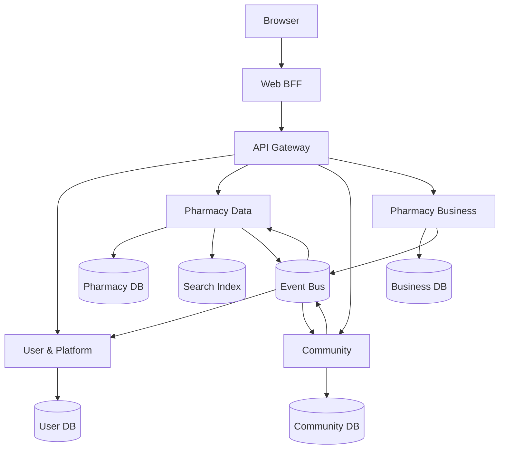
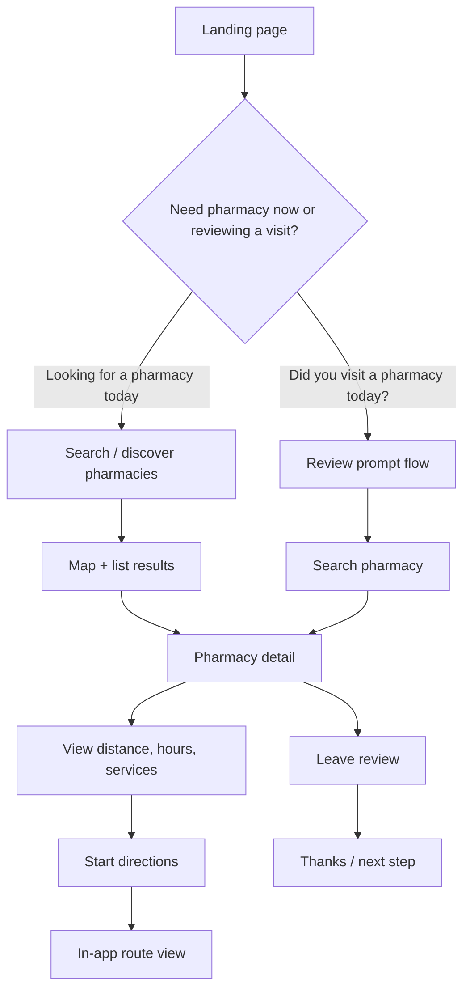

# Proposed microservices architecture for PharmacyPulse

This document turns the current Django monolith into a practical target architecture without forcing a full rewrite up front.

## 1. Recommended target shape

Use a Backend-for-Frontend (BFF) plus 4 backend services:

1. User & Platform
2. Pharmacy Data
3. Community
4. Pharmacy Business

The existing Django app can remain as the BFF during the migration, while the monolith logic is gradually extracted into services.

## 2. Why this split fits this project

The current codebase mixes several independent concerns:

- Read-heavy catalog and search workloads
- Review and moderation workflows
- Auth, compliance, and notifications
- Claim ownership, team management, and billing

Those areas have different scaling needs, failure modes, and release cadences, so they are good candidates for service boundaries.

## 3. Service boundaries

### 3.1 User & Platform

Owns:
- authentication and role management
- profiles and account settings
- newsletter subscriptions
- notifications
- consent and compliance records
- audit log writes

Extract from:
- auth_views.py
- resend_audience.py
- user admin flows in flows.py
- compliance behavior in flows.py
- activity log logic in signals.py

Responsibilities:
- login / signup / OAuth
- password reset and account recovery
- consent management
- CCPA export/delete orchestration
- notification delivery

### 3.2 Pharmacy Data

Owns:
- pharmacies
- pharmacy hours and services
- drug shortages
- pinned shortages
- zipcode centroids and enrichment data
- search index and geo queries

Extract from:
- page_data.py
- enrich.py
- geo.py
- management commands for NPPES, FDA sync, geocoding
- search and ingest flows in flows.py

Responsibilities:
- pharmacy catalog reads and writes
- enrichment from Google Places
- shortage imports and updates
- search and autocomplete
- map/list/detail data delivery

### 3.3 Community

Owns:
- reviews
- review responses
- review moderation
- saved comparisons
- response quotas and review-related rate limits

Extract from:
- review-related flows in flows.py
- signals.py review hooks
- compare flows in flows.py

Responsibilities:
- create/update/delete reviews
- moderation actions
- pharmacist responses
- saved comparison lists
- community activity events

### 3.4 Pharmacy Business

Owns:
- pharmacy claims
- pharmacy organizations and team members
- Stripe billing and subscriptions
- entitlements and pharmacist plan checks

Extract from:
- claim and team flows in flows.py
- billing flows in flows.py
- NPI verification logic

Responsibilities:
- ownership verification
- team invite/accept flows
- Stripe checkout and portal
- plan-based permissions

## 4. BFF layer

Keep the current Django SSR experience as a BFF.

Responsibilities:
- render pages for SEO and existing URLs
- combine data from the four services
- translate session-based requests into service calls
- proxy legacy flows during migration

This is the safest path because it avoids a full frontend rewrite while still allowing the backend to be split.

## 5. Cross-service communication

Use a mix of synchronous APIs and asynchronous events.

### Synchronous
Use REST for:
- user profile reads
- pharmacy detail reads
- review submission with immediate feedback
- billing checkout/session creation

### Asynchronous
Use events for:
- review created
- review response added
- claim approved
- subscription updated
- pharmacy updated

Suggested event transport:
- Redis Streams for smaller scale
- SNS + SQS or Kafka if traffic grows

## 6. Data ownership rules

Each service should own its own database.

Rules:
- no cross-database joins
- services reference each other by IDs only
- derived data such as review stats or search index can be updated asynchronously

Example:
- Pharmacy Data owns pharmacy IDs
- Community owns review IDs
- User & Platform owns user IDs
- Pharmacy Business owns organization and claim IDs

## 7. Suggested runtime topology

## 8. Migration strategy

Use the Strangler Fig pattern.

### Phase 1: foundation
- add gateway and observability
- define API contracts
- standardize auth with JWT
- introduce event bus

### Phase 2: extract Pharmacy Data
- move pharmacies, shortages, search, and enrichment first
- make the BFF call Pharmacy Data for list/map/detail/shortage pages

### Phase 3: extract Community
- move reviews and moderation into the Community service
- replace synchronous stat recomputation with events

### Phase 4: extract User & Platform and Pharmacy Business
- move auth, compliance, notifications, claims, team management, and billing
- retire old monolith paths once traffic is fully cut over

## 9. Practical recommendation

For this repository, start with a 2-step rollout if the team is still small:

1. Split out User & Platform early because it touches almost every request
2. Split out Pharmacy Data next because it is the largest read-heavy domain

Then extract Community and Pharmacy Business once the traffic and ownership model justify it.

## 10. Detailed product experience architecture

The product should be designed around a very simple review-recruitment loop rather than a broad directory experience.

### 10.1 MVP experience goals

1. Keep the experience simple and focused on one outcome: get users to find a pharmacy and leave a review.
2. Make the app feel trustworthy from day one, even before large volumes of data exist.
3. Keep users inside the app for discovery, map exploration, and directions.
4. Make the search and review journey feel obvious and low-friction.

### 10.2 Core user journey

### 10.3 Feature-area architecture

#### A. Entry and onboarding

Purpose:
- present two clear paths near the top
- reduce uncertainty for first-time users
- avoid overloading the home page with secondary features

Responsibilities:
- BFF renders the landing experience
- user state comes from User & Platform
- analytics and experiment flags are handled at the BFF layer

#### B. Discovery and search

Purpose:
- help users find a nearby pharmacy quickly
- support distance-based sorting and map-based discovery

Responsibilities:
- Pharmacy Data service owns pharmacy catalog, geolocation, and search index
- results include distance, hours, services, and trust signals
- the BFF aggregates results into a single page experience

#### C. Map and directions inside the app

Purpose:
- keep users in-system
- let them explore results spatially without leaving to Google Maps
- support route preview and basic turn-by-turn guidance

Architecture:
- the map view is a first-class experience in the BFF and uses Pharmacy Data for pharmacy coordinates and search results
- a lightweight directions module can sit beside Pharmacy Data as an internal location service
- for MVP, directions can be served as an in-app route summary with step-by-step navigation and estimated travel time
- if a third-party routing provider is needed later, it should be wrapped behind an internal adapter so the UI never depends directly on it

Recommended implementation split:
- Pharmacy Data: pharmacy coordinates, geocoding, nearby results, map markers
- Location Experience module: route calculation, map rendering, travel-time logic, in-app directions UI
- BFF: page composition and user-facing transitions

This keeps the product aligned with the client request to remain inside the app.

#### D. Pharmacy detail and review recruitment

Purpose:
- turn search results into action
- move users from discovery into a review action with minimal friction

Responsibilities:
- detail view is composed by the BFF from Pharmacy Data and Community
- Community service handles review submission and review history
- this is the main conversion funnel for the MVP

#### E. Review submission

Purpose:
- capture a review quickly after a visit
- keep the experience short and focused

Responsibilities:
- Community service stores review content, moderation state, and review metadata
- Pharmacy Data service updates derived pharmacy stats asynchronously after a review event
- User & Platform service handles account state and consent

#### F. Claims, ownership, and business workflows

Purpose:
- support pharmacist or owner onboarding later
- keep these flows separate from the core consumer experience

Responsibilities:
- Pharmacy Business service owns claims, team management, and billing
- User & Platform handles authentication and role assignment
- BFF exposes a simple owner dashboard once the user is recognized as a pharmacist

### 10.4 Product requirement mapping

| Requirement | Architectural response |
|---|---|
| Remove live metrics cards until real data exists | Replace with neutral placeholders and review-focused CTAs; avoid presenting fabricated numbers |
| Keep users inside the app | Build map, directions, and route preview fully in-app rather than linking out to Google Maps |
| Rework hero section | Use a simpler, less AI-feeling visual system and more human-centered messaging in the BFF |
| Add two entry paths | Make the homepage top section explicitly offer “Looking for a pharmacy today” and “Did you visit a pharmacy today?” |
| Focus on recruiting reviews | Make review submission the primary conversion action from search and detail pages |
| Keep distance and live map | Preserve these as core signals in Pharmacy Data and map UI |

### 10.5 MVP architecture recommendation

For the first release, keep the following shape:

- BFF: landing page, search page, pharmacy detail page, review flow, map shell
- Pharmacy Data: pharmacy catalog, geocoding, map results, distance logic, nearby search
- Community: reviews, review moderation, review history, response handling
- User & Platform: auth, consent, notifications, profile
- Pharmacy Business: claims, ownership, team, billing

This gives the product a strong “review recruitment” core while still leaving room for future growth.

## 11. Final recommendation

The best first version is:
- one BFF (Django SSR)
- one service for Pharmacy Data
- one service for Community
- one service for User & Platform
- one service for Pharmacy Business

That keeps the architecture realistic for this codebase while giving the team clear ownership boundaries and room to scale.
